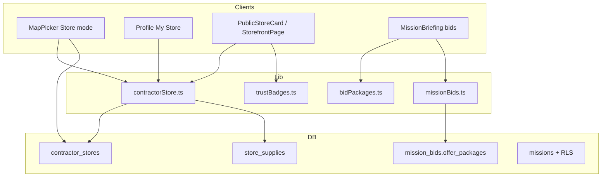
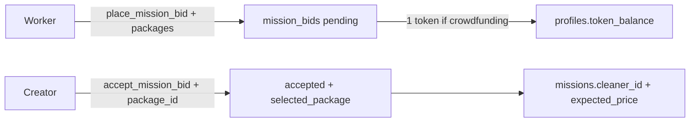

# Marketplace Architecture 2026 — Stores, Bidding & Security

> B2B/B2C cleaner marketplace expansion: contractor storefronts, spatial coverage, tiered bids, Zero-KYC trust badges, and missions RLS hardening.  
> Vault hub: [[🗺️ GARBAGIN Master Index]] · Overview: [[01_Architecture/Architecture_Overview]] · Migrations MOC: [[03_Backend_SQL/SQL_Migrations_Index]] · Frontend: [[02_Frontend/Frontend_Components]]

---

## Mental model



| Pillar | What shipped | Primary code |
| --- | --- | --- |
| Storefronts | Office pin, Idealista-style polygon, publish toggle | [[../supabase/migrations/20260726_contractor_stores.sql]], [[../src/lib/contractorStore.ts]] |
| Supplies / bundles / recurrence | Inventory table + JSONB packages + Subscribe & Save | [[../supabase/migrations/20260726_store_supplies_bundles_recurrence.sql]] |
| Tiered bids | Option A / B counter-offers | [[../supabase/migrations/20260726_tiered_bid_packages.sql]], [[../src/lib/bidPackages.ts]] |
| Trust badges | Client-computed Zero-KYC reputation | [[../src/lib/trustBadges.ts]], [[../components/TrustBadgeRow.tsx]] |
| Shareable B2B pages | `/store/:id`, `/cleaner/:id` | [[../components/StorefrontPage.tsx]], [[../App.tsx]] |
| Map UX | Lilac coverage, single/double-tap | [[../components/MapPicker.tsx]], [[../components/StoreCoverageMap.tsx]] |
| Security | Missions RLS + spatial CHECKs + border-safe geocode | [[../supabase/migrations/20260726_missions_schema_hardening.sql]], [[../supabase/migrations/20260726_fix_location_trigger_border.sql]] |

Product rules (tokens, Hungry-Games contact lock, no fiat escrow): [[../.cursorrules]].

---

## 1. Database schema & RLS hardening

### 1.1 Migration set (`20260726_*`)

| File | Role |
| --- | --- |
| [[../supabase/migrations/20260726_contractor_stores.sql]] | `contractor_stores` + RLS + `get_contractor_store(uuid)` |
| [[../supabase/migrations/20260726_store_supplies_bundles_recurrence.sql]] | `store_supplies`, bundles JSONB, recurrence, RPC updates |
| [[../supabase/migrations/20260726_tiered_bid_packages.sql]] | Bid package columns + `place_mission_bid` / `accept_mission_bid` |
| [[../supabase/migrations/20260726_global_location_catalog.sql]] | `location_catalog`, haversine, facets |
| [[../supabase/migrations/20260726_fix_location_trigger_border.sql]] | Cross-border-safe autofill |
| [[../supabase/migrations/20260726_missions_schema_hardening.sql]] | Missions RLS + CHECK constraints + consolidated trigger |

Related location filtering product note: [[01_Architecture/Global_Location_Filtering]].

---

### 1.2 `contractor_stores`

One storefront per contractor (`UNIQUE(owner_id)` → [[../profiles]] semantics via `profiles.id`).

| Column | Type | Notes |
| --- | --- | --- |
| `id` | `uuid` PK | |
| `owner_id` | `uuid` FK → `profiles` | Cascade delete |
| `office_lat` / `office_lng` | `double precision` | Office pin; CHECK ±90 / ±180 |
| `office_address` | `text` | Human label |
| `service_radius_polygon` | `jsonb` | GeoJSON **Polygon** (Idealista-style coverage) |
| `offered_services` | `text[]` | Cap 32 |
| `materials_and_chemicals` | `text[]` | Cap 48 (legacy free-text tags) |
| `store_photos` | `text[]` | Cap 12; Storage under `order-photos/stores/{userId}/…` |
| `store_name` / `store_bio` | `text` | Presentation |
| `is_published` | `boolean` | Draft vs live storefront |
| `service_bundles` | `jsonb` | Packaged deals (added in supplies migration) |
| `recurrence_type` | `text` | Primary advertised cadence |
| `supported_recurrence_types` | `text[]` | Multi-select Subscribe & Save |

**RLS (stores):**

| Policy | Who | Rule |
| --- | --- | --- |
| SELECT | `anon`, `authenticated` | `is_published = true` **OR** `owner_id = auth.uid()` |
| INSERT / UPDATE / DELETE | `authenticated` | Own row only |

**RPC:** `get_contractor_store(p_owner_id uuid)` — `SECURITY DEFINER`, returns published stores to everyone; drafts only to owner. Shape includes polygon, services, bundles, recurrence.

**Client CRUD:** [[../src/lib/contractorStore.ts]] — `fetchContractorStore`, `fetchPublishedContractorStores`, `upsertContractorStore`, `normalizePolygon`, `polygonLngLatBounds`.

---

### 1.3 Supplies, bundles & recurrence

#### `store_supplies` (relational inventory)

| Column | Notes |
| --- | --- |
| `store_id` | FK → `contractor_stores` ON DELETE CASCADE |
| `name`, `brand` | Product identity |
| `category` | `'Eco-Chemical'` \| `'Heavy Equipment'` \| `'Hygiene Supply'` |
| `image_url` | Optional gallery |
| `is_included_in_service` | Free with job vs paid add-on |
| `extra_price` | USD add-on when not included |
| `sort_order` | Display order |

RLS mirrors store visibility: published (or owner) can SELECT; owner CRUD.

Helpers: `fetchStoreSupplies`, `insertStoreSupply`, `deleteStoreSupply`, `uploadSupplyPhoto`.

#### `service_bundles` (JSONB on store)

Canonical element shape:

```json
{
  "id": "uuid",
  "title": "Terrace Deep Clean + Solar Wash",
  "description": "…",
  "service_ids": ["terrace_clean", "solar_wash"],
  "starting_price": 150
}
```

UI creator: [[../components/ContractorStorePanel.tsx]] (Bundles tab). Showcase: [[../components/StoreShowcaseSections.tsx]].

#### Recurrence (`Subscribe & Save`)

Allowed values: `one_time` | `weekly` | `bi_weekly` | `monthly`.

| Surface | Field | Meaning |
| --- | --- | --- |
| Store | `supported_recurrence_types` + `recurrence_type` | Contractor accepts regular clients |
| Mission | `missions.recurrence_type` | Customer flags recurring request |

Create path: `create_lead_mission_with_token(..., p_recurrence_type)` — see [[../supabase/migrations/20260726_store_supplies_bundles_recurrence.sql]].

---

### 1.4 Missions schema hardening & geocoding safety

Audit context (from migration header): RLS was **disabled** on `missions` while `anon`/`authenticated` held broad INSERT/UPDATE/DELETE/**TRUNCATE** grants — a public anon key could wipe the table.

**Hardening in** [[../supabase/migrations/20260726_missions_schema_hardening.sql]]:

1. **CHECK constraints** (NOT VALID → VALIDATE):
   - `missions_lat_range` — `location_lat ∈ [-90, 90]`
   - `missions_lng_range` — `location_lng ∈ [-180, 180]`
   - `missions_country_length` / `missions_city_length` — ≤ 120 chars (matches RPC caps)
2. **RLS enabled** on `public.missions` with scoped policies:
   - World-readable SELECT (map + Live Market as logged-out landing)
   - No open INSERT policy — creates go through `SECURITY DEFINER` RPCs (`create_lead_mission_with_token`, `create_garbage_zone_report`) so the 1-token placement cannot be bypassed
   - Creator / cleaner / admin UPDATE-DELETE paths as documented in the migration comments
3. **REVOKE** dangerous table-level grants (TRUNCATE/DELETE for public roles)
4. Re-assert location indexes + `list_mission_location_facets()`

**Cross-border geocoding** — trigger `missions_fill_location_from_catalog` / `trg_missions_fill_location`:

| Case | Behavior |
| --- | --- |
| Client sent country **and** city | Trust client (Mapbox reverse geocode wins) |
| Country known, city missing | Nearest catalog city **only within that country** (≤ 300 km); else leave city NULL |
| City known, country missing | Infer country from catalog city name (nearest match) |
| Neither | Nearest city globally within radius |

Fix migration: [[../supabase/migrations/20260726_fix_location_trigger_border.sql]] (consolidated into hardening). Prevents e.g. Belgium pin labeled `city=Lille` (France).

Security companion notes: [[01_Architecture/Security_and_RPCs]], [[01_Architecture/Global_Location_Filtering]].

---

## 2. Mapbox UI/UX & spatial interactions

### 2.1 Visual language (lilac coverage)

| Token | Value | Usage |
| --- | --- | --- |
| Fill | `#a855f7` @ **0.25** opacity | Service radius polygon |
| Stroke | `#c084fc` ~2.25–2.5 px | Soft border |
| Office pin | Lilac / violet glow | Store mode markers |

Implemented on:

- Main map Store mode — [[../components/MapPicker.tsx]] (`store-coverage-fill` / `store-coverage-line`)
- Editor + read-only embeds — [[../components/StoreCoverageMap.tsx]]

### 2.2 Store mode dual-interaction (`MapPicker`)

```mermaid
sequenceDiagram
  participant U as User
  participant M as MapPicker
  participant Prev as MapStorePreviewCard
  participant Ovl as StoreProfileOverlay

  U->>M: Single tap store pin
  M->>M: setSelectedStore + fitBounds(polygon)
  M->>Prev: Open brief card
  Note over M: Lilac Source remount + setData sync

  U->>M: Second tap same pin &lt; ~380ms
  M->>Prev: Close preview
  M->>Ovl: Portal PublicStoreCard (owner_id)
```

| Gesture | Threshold | Behavior |
| --- | --- | --- |
| **Single tap** | — | Select store, render lilac polygon, `fitBounds` (padding bottom for card), open [[../components/MapStorePreviewCard.tsx]] |
| **Double tap** | Same `store_id` within **~380 ms** | Close preview → [[../components/StoreProfileOverlay.tsx]] (portaled full storefront) |
| Empty map tap | — | Clear selection / coverage |

Polygon pipeline:

1. `fetchPublishedContractorStores()` → `rowToContractorStore` → `normalizePolygon`
2. `storeCoverageGeoJSON` deep-clones coordinates for Mapbox Source freshness
3. Source `key={store-coverage-${id}}` + imperative `setData` when selection changes
4. `polygonLngLatBounds()` drives camera framing

### 2.3 Embedded profile map

| Context | Component | Behavior |
| --- | --- | --- |
| Public profile / overlay | [[../components/PublicStoreCard.tsx]] → `StoreCoverageMap` `interactive={false}` | Lilac zone on load |
| My Store editor | [[../components/ContractorStorePanel.tsx]] | Click-to-draw vertices, close polygon |
| Standalone B2B page | [[../components/StorefrontPage.tsx]] | Same read-only map |

**Read-only tap:** single tap calls `fitBounds()` on the polygon so the whole zone fits the small frame (`storeTapMapToFitZone` i18n).

**Sanitization** (`normalizePolygon` in [[../src/lib/contractorStore.ts]]):

- Parses stringified JSON
- Unwraps GeoJSON `Feature` / `FeatureCollection`
- Requires `type: Polygon`, closes rings, drops invalid vertices

---

## 3. SaaS & marketplace business features

### 3.1 eBay-style tiered bidding

Workers may attach **1–3 packaged offers** when placing a bid.

| Package | Typical meaning |
| --- | --- |
| **Option A — Basic labor** | Customer supplies materials (`includes_supplies: false`) |
| **Option B — All-inclusive** | Eco-chemicals / equipment from store inventory included |

Types & defaults: [[../src/lib/bidPackages.ts]] (`createDefaultBidPackages`, `normalizeBidOfferPackages`).

**DB** (`mission_bids`):

| Column | Role |
| --- | --- |
| `offer_packages` | JSONB array of packages |
| `selected_package_id` / `selected_package` | Snapshot on accept |

**RPCs:**

| Function | Signature highlight | Behavior |
| --- | --- | --- |
| `place_mission_bid` | `(uuid, integer, jsonb DEFAULT NULL)` | Normalizes packages; `bid_amount` = min package price when packages present; crowdfunding still deducts **1 token** |
| `accept_mission_bid` | `(uuid, text DEFAULT NULL)` | Creator must pick `p_package_id` when multiple packages; locks `expected_price` to package price |

Client: [[../src/lib/missionBids.ts]] (`placeMissionBid`, `acceptMissionBid`, `rowToMissionBid`).

UI:

- Place / accept packages — [[../components/MissionBriefing.tsx]]
- My Orders accept packages — [[../components/Profile.tsx]]
- Orchestration — [[../components/MapPicker.tsx]]

Crowdfunding bid stake + dynamic funding accept rules: [[01_Architecture/P2P_Deal_Flow]], [[01_Architecture/Stripe_USD_Flow]], [[../.cursorrules]].



---

### 3.2 Zero-KYC trust badges

Client-side reputation from **store completeness + activity** — no extra KYC for these badges (ID verification remains separate: [[01_Architecture/KYC_Verification]]).

| Badge id | Label | Qualification (`computeTrustBadges`) |
| --- | --- | --- |
| `eco_expert` | Eco-Expert | Eco-Chemical supply category **or** eco/biodegradable keywords in supplies / materials |
| `verified_community` | Verified by Community | Rating ≥ **4.8** and ≥ **3** completed missions as cleaner |
| `fully_equipped` | Fully Equipped | Heavy Equipment supply **or** ≥ 3 supply rows |
| `custom_coverage` | Custom Coverage | Published store has `service_radius_polygon` |

Code: [[../src/lib/trustBadges.ts]] · UI pills: [[../components/TrustBadgeRow.tsx]].

Surfaces:

- [[../components/PublicStoreCard.tsx]], [[../components/StorefrontPage.tsx]]
- [[../components/LiveMarketFeed.tsx]] / [[../components/MissionFeedCard.tsx]]
- [[../components/ImmersiveMissionFeed.tsx]] right sidebar

---

### 3.3 Shareable B2B storefronts

| Route | Component | Purpose |
| --- | --- | --- |
| `/store/:id` | [[../components/StorefrontPage.tsx]] | Canonical shareable landing (`id` = `owner_id`) |
| `/cleaner/:id` | Same | Alias for external campaigns |
| `/profile/:id` | [[../components/PublicProfile.tsx]] | Profile + embedded `PublicStoreCard` |

Registered in [[../App.tsx]].

**Share Store** (`shareStoreLink` in [[../src/lib/trustBadges.ts]]):

1. Prefer `navigator.share({ title, text, url })`
2. Fallback: `navigator.clipboard.writeText` → `/store/{ownerId}`

CTAs: My Store panel (when published), PublicStoreCard, StorefrontPage header.

Map preview CTA opens full overlay or `/store/:id` — [[../components/MapStorePreviewCard.tsx]].

---

## Component & lib dependency map

| Layer | Files |
| --- | --- |
| Routes | [[../App.tsx]] |
| Map | [[../components/MapPicker.tsx]], [[../components/StoreCoverageMap.tsx]], [[../components/MapStorePreviewCard.tsx]], [[../components/StoreProfileOverlay.tsx]] |
| Store UI | [[../components/ContractorStorePanel.tsx]], [[../components/PublicStoreCard.tsx]], [[../components/StorefrontPage.tsx]], [[../components/StoreShowcaseSections.tsx]] |
| Trust | [[../components/TrustBadgeRow.tsx]], [[../src/lib/trustBadges.ts]] |
| Bids | [[../components/MissionBriefing.tsx]], [[../src/lib/missionBids.ts]], [[../src/lib/bidPackages.ts]] |
| Domain | [[../src/lib/contractorStore.ts]] |
| i18n | [[../src/i18n.ts]] (`store*`, `badge*`, `bidPackage*`, `recurrence*`) |

---

## RPC quick reference

| RPC | Purpose |
| --- | --- |
| `get_contractor_store(p_owner_id)` | Public/draft storefront fetch |
| `create_lead_mission_with_token(..., p_recurrence_type)` | Create mission + optional schedule |
| `place_mission_bid(p_mission_id, p_bid_amount, p_offer_packages)` | Bid ± packages; 1-token on crowdfunding |
| `accept_mission_bid(p_bid_id, p_package_id)` | Accept specific package |
| `missions_fill_location_from_catalog` | Trigger FN — border-safe city/country fill |
| `list_mission_location_facets()` | Filter facet counts |

---

## Related vault notes

- [[01_Architecture/Architecture_Overview]]
- [[01_Architecture/Security_and_RPCs]]
- [[01_Architecture/P2P_Deal_Flow]]
- [[01_Architecture/Stripe_USD_Flow]]
- [[01_Architecture/KYC_Verification]]
- [[01_Architecture/Global_Location_Filtering]]
- [[02_Frontend/Frontend_Components]]
- [[03_Backend_SQL/SQL_Migrations_Index]]
- [[04_Roadmap_Tasks/Roadmap_to_GooglePlay]]
- [[../.cursorrules]]
