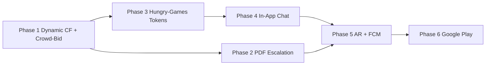

# 🚀 Roadmap to Google Play

> Long-term product & engineering roadmap from **current marketplace terminal** → **public Android release**.
> Grounded in the post-audit stack (Stripe Checkout + webhook, token-boost, PostGIS GPS gate, neon map UI) and the **new business rules** for Hungry-Games bidding, dynamic crowdfunding timers, and municipal escalation.

## Hub links
- Master index → [[🗺️ GARBAGIN Master Index]]
- Field dashboard → [[04_Roadmap_Tasks/00_Dashboard]]
- Architecture → [[01_Architecture/Architecture_Overview]]
- Frontend → [[02_Frontend/Frontend_Components]]
- Migrations → [[03_Backend_SQL/SQL_Migrations_Index]]
- Stripe / USD → [[01_Architecture/Stripe_USD_Flow]]
- Eco-ultimatum / Garbage History → [[04_Roadmap_Tasks/Garbage_History_Lifecycle]]
- Lifecycle audit → [[docs/GARBAGIN_LIFECYCLE_AUDIT]]
- Wave A (overfund refund / creator convert) → [[04_Roadmap_Tasks/Lifecycle_Fix_Wave_A]]
- Wave B (failed retry / crowd abandon exclude / P2P confirm RPC) → [[04_Roadmap_Tasks/Lifecycle_Fix_Wave_B]]
- Wave C (token rank / Profile approved / funded DELETE) → [[04_Roadmap_Tasks/Lifecycle_Fix_Wave_C]]
- Wave D (7-day Garbage History / R2 purge / n8n) → [[04_Roadmap_Tasks/Lifecycle_Fix_Wave_D]]
- Wave E (vault + CLI history hygiene) → [[04_Roadmap_Tasks/Lifecycle_Fix_Wave_E]]
- Wave F (admin allowlist / mission column lock) → [[04_Roadmap_Tasks/Lifecycle_Fix_Wave_F]]
- Wave G (underfund accept / reject RPC / expiry unlock) → [[04_Roadmap_Tasks/Lifecycle_Fix_Wave_G]]
- Wave H (push token / fail-closed Edge / Hungry-Games sub) → [[04_Roadmap_Tasks/Lifecycle_Fix_Wave_H]]
- E2E audit (SEC-4 still open) → [[docs/GARBAGIN_E2E_AUDIT_2026-09-15]]
- Apply runbook (P0→H + Hungry-Games) → [[docs/LIFECYCLE_FIX_APPLY_RUNBOOK]]
- CLI history repair → [[04_Roadmap_Tasks/Ops_Migration_History_Repair]]
- P2P deals → [[01_Architecture/P2P_Deal_Flow]]
- Security & RPCs → [[01_Architecture/Security_and_RPCs]]
- KYC → [[01_Architecture/KYC_Verification]]
- Prior status note → [[05_Archive/Garbagin_Roadmap_Update]]
- Project rules → [[.cursorrules]]

---

## North Star

**Garbagin** is a cyberpunk marketplace terminal for garbage cleaning and municipal tasks in Egypt.

| Pillar | Rule |
| --- | --- |
| Fiat | **No internal escrow payouts.** Standard jobs = direct P2P. Crowdfunding = Stripe contributions held by the platform until target / expiry. |
| Crowdfunding | Garbage Removal campaigns raise USD; on expiry **funds are not card-refunded** — they feed the municipal PDF escalation path. |
| Tokens | Used for posting, boosting, and **Hungry-Games bid stakes** (1 token per bid). |
| Privacy | Map is public; **client phone is never shown** on private tasks until a bid is **accepted**. Crowdfunding is public by design (no private client phone). |
| Launch | Google Play after Phases 1–5 are shippable + Play Console / AAB / permissions locked. |

---

## Current baseline (already shipped)

Use this as the floor — do **not** rebuild what works.

- [x] Map-first React shell + neon FAB filter / joystick controls
- [x] Crowdfunding Stripe Checkout + `apply_stripe_contribution` (idempotent) + **`stripe-webhook`**
- [x] Dynamic timers: 7-day create / civic pin; **+30d** on each successful Stripe dollar (`20260722_dynamic_crowdfunding_timers.sql` + `apply_stripe_contribution`)
- [x] Crowd-bid during `funding` + accept-while-raising (`20260722_place_mission_bid_crowd_funding.sql`, `20260723_dynamic_funding_bid_acceptance.sql`)
- [x] P0→D lifecycle: `$0` quiet hide, first-donate wake, overfund refund, reject-retry, history 7d / R2 purge / gated n8n — [[04_Roadmap_Tasks/Garbage_History_Lifecycle]] §8
- [x] City PDF pipeline (`city-notification-pipeline`) + Telegram / Resend ops channel
- [x] Token packs / subscription rails (Stripe intents)
- [x] Token-boost listing rank (`amount_target`) — USD must not land here (Wave C)
- [x] P2P proof lifecycle + PostGIS ≤200m GPS gate + `confirm_mission_work_done` (Wave B)
- [x] KYC admin queue + signed media
- [x] In-app notification bell (DB-backed; FCM Edge scaffold exists, secrets not live)
- [x] Hungry-Games: 1 token / bid + phone locked until accept + **active subscription** for new bids (admins exempt) — [[04_Roadmap_Tasks/Lifecycle_Fix_Wave_H]]
- [x] In-app P2P chat (`mission_chats` + MissionChatPanel)
- [x] Lazy WebXR [[../src/components/AROverlay]] (field-unvalidated)

**Gap to Play:** AR field proof, FCM secrets + expiry pings, Android packaging / Play Console. Lifecycle SQL (P0→H) is on live and on `main` (`cbf5c62`). SEC-4 Vercel `/api/*` auth still open.

---

## Phase 1 — Dynamic Crowdfunding Engine & Crowd-Bidding

> **Goal:** Make funding campaigns feel alive (timer extends on real money) and let workers compete on price before / as the pot fills.

### Business rules (canonical)

#### Dynamic expiry timers
- [x] **New campaign @ $0 raised** → funding window = **7 days** from create (`crowdfunding_expires_at = created_at + 7d`). Civic `reported` pins use the same 7d quiet-hide clock (P0-1).
- [x] **Any successful Stripe contribution** → reset / extend timer to **+30 days from that payment’s timestamp** (not from create) inside `apply_stripe_contribution` (`FOR UPDATE`).
- [x] Subsequent contributions **re-apply** the +30d extension from the **latest** successful payment (`GREATEST(expires, now()+30d)`).
- [x] Soft-expiry UI + checkout/apply/webhook **honor** the same `crowdfunding_expires_at` (no soft-expired contributes).
- [x] Expiry sweep (`process_expired_crowdfunding_missions`): `$0` → `hidden` (no Gov Notice); `0 < raised < target` → `expired` + city queue (P0-1). Race-hardened (`FOR UPDATE SKIP LOCKED`).

#### Crowd-bidding
- [x] Workers may **place bids while status = `funding`** (and after `available`) — `20260722_place_mission_bid_crowd_funding.sql`.
- [x] Bid modes:
	- [x] **Accept target** — bid = current campaign `expected_price` (work budget).
	- [x] **Propose own price** — worker may bid **higher or lower** than the target (“I will finish for $X”) / tiered packages.
- [x] Creator can **accept one bid during `funding`** → `cleaner_id` locked, status **stays `funding`** until donations hit the (possibly bumped) `expected_price`, then `in_progress` (skip re-tender). `20260723_dynamic_funding_bid_acceptance.sql` · [[../.cursorrules]].
- [x] UI: crowdfunding briefing shows **Contribute** *and* **Bid / Propose price**.
- [x] State machine (locked):

```
funding ──(target met, no cleaner)──► available ──(accept bid)──► in_progress ► review ► completed
   │
   └──(crowd-bid accepted while funding)──► stay funding + cleaner locked
         └──(donations fill new goal)──► in_progress (no re-bid)
   └──(timer expired, raised = 0)──► hidden          (P0-1, no PDF)
   └──(timer expired, 0 < raised < target)──► expired → Phase 2 / Wave D history
```

> **Product decision (locked):** yes — a bid **may** be accepted before the USD target is full. Cleaner is locked; pot keeps filling; Live Market still shows the pin. Documented in [[P2P_Deal_Flow]], [[04_Roadmap_Tasks/Garbage_History_Lifecycle]], [[../.cursorrules]].

### Engineering notes
- Touch points: `apply_stripe_contribution`, checkout/confirm/webhook metadata, [[../src/lib/crowdfunding]], [[../components/MissionBriefing]], bid RPCs (`accept_mission_bid` allowlist).
- Extend timer **inside** `apply_stripe_contribution` under `FOR UPDATE` so concurrent payments serialize the new expiry.
- Seed / admin tools: assert 7d→30d behavior in SQL tests or seed scripts.

### Exit criteria
- [x] Contribute $1 on a fresh $0 campaign → UI countdown jumps to ~30 days (and first dollar wakes `reported` — P0-2).
- [x] Worker can submit a custom-price bid on a live crowdfunding pin.
- [x] Soft-expired campaign rejects Checkout + webhook apply (paid reject → Wave A auto-refund if the pot never accepted the Session).

---

## Phase 2 — PDF Pipeline & Municipal Escalation (City-Notification)

> **Goal:** Close the “funds retained as processing fee → city notified” promise with real PDFs and admin/Telegram delivery.

### Business rules (canonical)

#### Success state (funded + completed)
- [x] When a crowdfunding mission reaches **`completed`**, enqueue `mission_completed` → Edge Function **`city-notification-pipeline`** builds success PDF (location, raised vs target, description, timestamps).
- [x] Store PDF in Storage bucket `city-notifications` + `pdf_url` on `city_notification_events`.
- [ ] Optional: notify contributors (in-app / later FCM) that the cleanup is done.
- [ ] Enrich PDF with before/after photos + cleaner public identity + GPS integrity summary.

#### Stuck / expired state (30-day window ends underfunded)
- [x] When timer expires underfunded: status → `expired` + `city_notification_events` (`crowdfunding_expired`).
- [x] **Municipal escalation PDF** via `city-notification-pipeline` (coords, raised/target, description, fee / no-refund notice).
- [x] **Deliver** PDF to Telegram (`TELEGRAM_BOT_TOKEN` + `TELEGRAM_CHAT_ID`); email via Resend when configured (else stub log).
- [x] Funds remain platform-retained on **expiry with money raised** (processing fee) — **no** Stripe refund on eco-ultimatum. Separate: a Checkout the pot never accepted is auto-refunded (P0-3) — [[04_Roadmap_Tasks/Lifecycle_Fix_Wave_A]].

### Engineering notes
- Edge Function: `supabase/functions/city-notification-pipeline` (pdf-lib → Storage → Telegram / Resend stub).
- Migration: `supabase/migrations/20260722_city_notification_pipeline.sql` (columns, bucket, completion enqueue, `pg_net` INSERT trigger).
- Configure URL/keys via `private.app_config` (no `ALTER DATABASE`): `supabase/manual/configure_city_notification_webhook.sql`.
- Deploy with `verify_jwt=false`; set secrets; run migration `20260723_…_app_config` + configure script (paste service role key).
- Keep expiry sweep cron (`process_expired_crowdfunding_missions`) so rows are inserted.
- Wave D: 7-day Garbage History + archive cron + optional n8n / R2 purge — [[04_Roadmap_Tasks/Lifecycle_Fix_Wave_D]] (SQL on live; client may still be in PR #7).
- Apply / verify order: [[docs/LIFECYCLE_FIX_APPLY_RUNBOOK]]. CLI history: [[04_Roadmap_Tasks/Ops_Migration_History_Repair]].

### Exit criteria
- [ ] Expired underfunded mission produces a downloadable PDF in Storage within N minutes (after deploy + secrets).
- [ ] Admin email + Telegram receive the same artifact.
- [ ] Completed crowdfunding mission produces a success PDF linked in admin / mission history.

---

## Phase 3 — “Hungry-Games” Anti-Spam & Token Economy

> **Goal:** Public discovery without doxxing clients; spam-resistant bidding via subscription + 1-token stake.

### Business rules (canonical)

#### Public map vs private data
- [x] **Anyone** who installs the app can see the **map and all orders** (browsing is open).
- [x] For **ALL private tasks** (home / office / non-crowdfunding P2P):
	- [x] Client **phone number is strictly hidden** — no exceptions, no “preview digits.” (`get_mission_client_phone` + column SELECT revoke)
- [x] Crowdfunding (Garbage Removal / public space):
	- [x] Fully **open and public**.
	- [x] **No private client phone** attached to the pin (RPC always returns NULL when `crowdfunding_mode`).

#### Token-gated bidding (Hungry-Games)
- [x] Worker must have an **active subscription** to place any **new** bid (`place_mission_bid`; admins exempt; pending updates skip re-check) — [[04_Roadmap_Tasks/Lifecycle_Fix_Wave_H]]
- [x] Placing a bid costs exactly **1 Token** on crowdfunding (non-refundable stake).
- [x] Deduct token **atomically** with bid insert (`FOR UPDATE` on `profiles.token_balance`) — no free bids on race.
- [ ] Token-boost for **listing promotion** remains separate from the 1-token bid stake.

#### Tender win → unlock contact
- [x] Only when the creator **explicitly accepts** a worker’s bid (or worker is assigned cleaner):
	- [x] Mission → `in_progress`, cleaner assigned.
	- [x] Worker unlocks the client’s **private phone number** via `get_mission_client_phone`.
- [x] Until accept: briefing shows masked `+20 1XX XXX XXXX` + “Locked until bid acceptance” / RU equivalent.

### Engineering notes
- Migration: `supabase/migrations/20260723_hide_client_phone_until_bid_accept.sql`
- Helpers: `src/lib/missionContact.ts`; UI: `MissionBriefing` + `MapPicker`.
- RLS / column: `REVOKE SELECT (phone_number)` on `profiles` for `anon`/`authenticated`; use RPCs instead.
- Update `.cursorrules` TOKENS MODEL bullet to include **1 token / bid**.
- Retire remaining trust-deposit UX copy if still present (audit Jul 2026: dead i18n keys removed; gate lives in `homeMissionAccess.ts`).

### Exit criteria
- [ ] Logged-out / free user sees pins but cannot bid.
- [ ] Subscribed user without tokens cannot bid; with ≥1 token, balance drops by 1 on bid.
- [x] Phone visible to cleaner **only** after accept; crowdfunding pins never expose a client phone.

---

## Phase 4 — In-App P2P Chat

> **Goal:** Negotiate on-platform before tender win; delay WhatsApp leakage until contact unlock.

### Business rules (canonical)
- [x] Direct messaging between **client and interested workers** on a mission thread (schema + RLS + Realtime scaffold).
- [x] Allowed **before** bid accept (negotiate price / scope) and after (coordination) — participant = creator / pending|accepted bidder / assigned cleaner.
- [x] Scope RLS: only mission creator + bidders / assigned cleaner (`mission_chats` policies).
- [ ] No broadcasting phone numbers inside chat system messages until unlock (Phase 3) — enforce in UI/moderation next.
- [ ] Optional: soft-prompt WhatsApp **only after** accept as secondary channel.

### Engineering notes
- Migration: [[../supabase/migrations/20260723_p2p_chat_system.sql]] → table `mission_chats` + Realtime publication.
- Hook: [[../src/hooks/useMissionChat.ts]] (`useMissionChat(missionId, otherUserId)`).
- UI: [[../src/components/chat/MissionChatPanel.tsx]] + CTAs in [[../components/MissionBriefing]].
- Hooks into Phase 5 push (“new message”).

### Exit criteria
- [x] Client and bidder exchange messages without leaving the app (MissionChatPanel + briefing CTAs).
- [ ] Unrelated users cannot read the thread (RLS verified).

---

## Phase 5 — AR Field Test & Push Notifications

> **Goal:** Field-grade proof of cleanup + timely alerts that survive backgrounded mobile sessions.

### AR (Hurghada field test)
- [ ] WebXR / camera overlay verifies worker is at pin (align with PostGIS gate).
- [ ] Visual confirmation of cleanup progress / completion framing.
- [ ] Validate: session start, GPS marker accuracy, crowdfunding progress on AR HUD.
- [ ] Fallback UX when WebXR unsupported (already partially present — harden for Play).

### Push notifications (FCM / Supabase)
- [x] Device token table + RLS (`user_push_tokens`) + upsert RPC.
- [x] Scaffold: Edge Function `send-push-notification` + pg_net trigger on `notifications` INSERT.
- [x] Client registration hook (`usePushNotifications` / `pushNotifications.ts`) + SW stub.
- [ ] Configure Firebase / VAPID secrets and deploy Edge Function (see `supabase/manual/configure_push_webhook.sql`).
- [ ] Mandatory event set (already creates in-app rows → push via trigger once secrets live):
	- [x] Bid accepted (worker) / new bid (client) — via notification triggers
	- [ ] Crowdfunding timer expiring (24h / 1h) — still needs scheduled notifier
	- [x] New in-app chat message
	- [x] Proof uploaded / proof rejected / mission completed
- [x] Keep existing in-app bell in sync with push payloads (same `notifications` row).

### Exit criteria
- [ ] Hurghada checklist from [[04_Roadmap_Tasks/00_Dashboard]] fully green.
- [ ] Force-killed app still receives bid-accepted push on a test device.

---

## Phase 6 — Google Play Store Release Track

> **Goal:** Ship a compliant Android App Bundle with privacy, permissions, and staged rollout.

### Product / store assets
- [ ] App icon (adaptive) + feature graphic
- [ ] Splash screen aligned with neon brand
- [ ] Short / full store description (EN + RU minimum; AR optional)
- [ ] Screenshots: map, crowdfunding contribute, Hungry-Games bid, AR proof

### Android packaging
- [ ] Capacitor / TWA / React Native shell decision documented (recommend **Capacitor** over map+WebXR stack unless native rewrite planned)
- [ ] Generate **Android App Bundle (`.aab`)**
- [ ] Permissions declared & justified:
	- [ ] **Location** (precise) — mission pins, geolocate, proof GPS
	- [ ] **Camera** — proof photos, KYC liveness, AR
	- [ ] **Notifications** — FCM
- [ ] Privacy Policy URL + Terms (existing web routes `/privacy`, `/terms`) linked in Play Console
- [ ] Data safety form (location, photos, financial via Stripe)

### Google Play Console
- [ ] Create app listing + signing key / Play App Signing
- [ ] **Internal testing** track → Closed testing → Production
- [ ] Content rating questionnaire
- [ ] Target API level / 64-bit compliance
- [ ] Crash / ANR monitoring (Play Vitals)

### Exit criteria
- [ ] Internal track install works for ops team on physical Android devices
- [ ] Closed test completes crowdfunding contribute + Hungry-Games bid + proof without blocker bugs
- [ ] Production release candidate tagged in git

---

## Suggested sequencing & dependencies



| Order | Why |
| --- | --- |
| **1 → 2** | Timer rules must be final before municipal PDF copy/dates are trustworthy. |
| **1 → 3** | Crowd-bid UX shares MissionBriefing; Hungry-Games gates that UX. |
| **3 → 4** | Chat without phone unlock is the anti-leak story. |
| **2 + 4 → 5** | Push covers expiry + messages; AR is independent but shares field-test window. |
| **5 → 6** | Don’t freeze Play assets until AR/push permission copy is honest. |

---

## Definition of Done — “Ready for Google Play”

- [ ] Phases 1–5 exit criteria checked
- [ ] Stripe webhook live in production; no orphaned paid sessions in staging soak
- [ ] No client phone leakage on private tasks (security review / RLS audit)
- [ ] Crowdfunding expiry → PDF → Admin email + Telegram verified end-to-end
- [x] Hungry-Games: subscription + 1 token deducted per bid
- [ ] `.aab` uploaded; Internal + Closed tracks signed off
- [ ] Privacy Policy / Terms URLs live and linked

---

## Risk register (keep visible)

| Risk | Mitigation |
| --- | --- |
| Accepting bids before full funding confuses contributors | Lock product rule early; show “bid accepted — funding continues / escrow note” in UI |
| Timer extension abused by $1 micro-payments forever | Cap extensions (e.g. max N resets) or min contribution to reset — **decide in Phase 1** |
| PDF delivery fails silently | Idempotent job queue + admin “retry PDF” in dashboard |
| Token bid stake feels punitive | Clear UX copy + subscription value framing |
| WebXR flaky on Android WebView | Capacitor native camera fallback for proof; AR as progressive enhancement |
| Play rejects precise location | Justify in Data safety + in-app disclosure before first GPS prompt |

---

## Changelog

| Date | Note |
| --- | --- |
| 2026-09-17 | Waves F/G/H + Hungry-Games subscription on `main` (`cbf5c62`). Vault: [[04_Roadmap_Tasks/Lifecycle_Fix_Wave_F]] · [[04_Roadmap_Tasks/Lifecycle_Fix_Wave_G]] · [[04_Roadmap_Tasks/Lifecycle_Fix_Wave_H]]. |
| 2026-09-12 | Wave E: Phase 1 timers + crowd-bid + accept-during-funding marked shipped; P0→D / PDF / Hungry-Games / chat moved into baseline. Hygiene: [[04_Roadmap_Tasks/Lifecycle_Fix_Wave_E]]. |
| 2026-07-22 | Initial Roadmap to Google Play authored from new business rules + post-stabilization architecture. |

---

> _Next action:_ Repair CLI history for `20260912` / `20260917` ([[04_Roadmap_Tasks/Ops_Migration_History_Repair]]). Set Edge secrets `PUSH_WEBHOOK_SECRET` / `CITY_NOTIFICATION_WEBHOOK_SECRET`. Remaining Play blockers: SEC-4 Vercel `/api/*`, FCM secrets, AR field test, AAB / Play Console.
